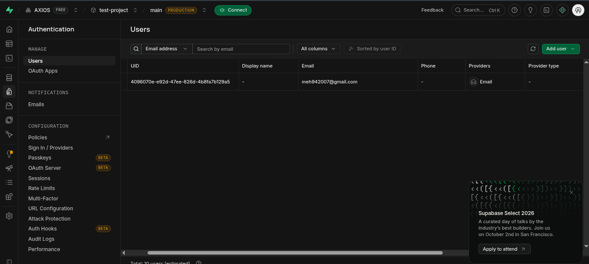

# Auth-Login API 🚀

Bhai, this is a secure backend API built with Node.js, Express, and Supabase Auth. It handles the complete authentication flow (Signup, Login, Logout, and Protected Routes) exactly as required for the assignment.

## Database Evidence
Check this out, our users are sitting perfectly inside the Supabase database:



---

## Setup 

1. Create a `.env` file in the root folder and drop your Supabase keys there:
   ```env
   PORT=3000
   SUPABASE_URL=your_supabase_url
   SUPABASE_KEY=your_anon_public_key
   ```
   
2. **🚨 Crucial Supabase Step (Don't skip this, bhai!):** 
   By default, Supabase requires users to verify their emails. For local testing, you need to turn this off:
   * Go to your Supabase Dashboard.
   * Click **Authentication** -> **Providers** -> **Email**.
   * Toggle **"Confirm email"** to **OFF** and hit Save. *(If you skip this, your logins will fail with a 401 Unauthorized error!)*

3. Install the packages:
   ```bash
   pnpm install
   ```

## Run It

```bash
pnpm dev
```
The server will start on `http://localhost:3000`. The scene is totally on!

---

## How to Check / Test

Everything is built into Swagger UI. No need for Postman, boss.

1. Open your browser and go to: **`http://localhost:3000/docs`**
2. **Sign Up**: Open the `/auth/signup` route, click "Try it out", enter an email and password, and hit Execute.
3. **Log In**: Go to `/auth/login` and log in with the same details. You will get a long `access_token` in the response.
4. **Lock The API**: Copy that token. Click the **"Authorize"** lock icon at the top of the Swagger page, paste your token there, and authorize it.
5. **Test Guard**: Now hit the `/protected/profile` route. If you get a `200 OK` with a "Sweet!" message and your user data, it means our JWT guard is working first-class!
